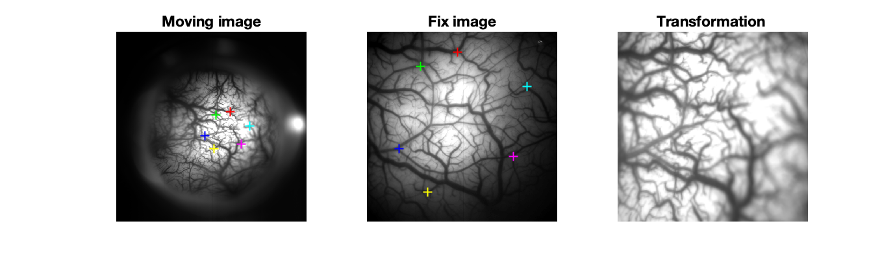
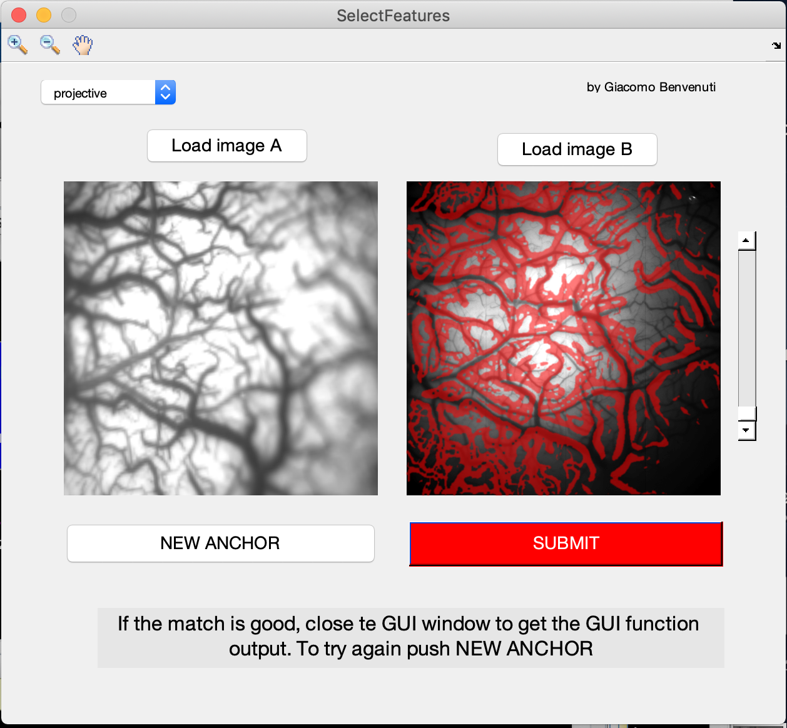

### :octopus: [giacomox - Home](https://giacomox.github.io/#/RetinoProj/README) :octopus:

# Brute Force Registration
Image registration by selecting corresponding features' locations in two images by hand (e.g. Vasculature corners). This repository contains a GUI function to select corresponding features in two images and find the best transformation to match them (**SelectFeatures.m**). 
To see how it works run the script DEMO.m

<p align="center">

</p>

## Fit geometric transformation
* The main algorithm in this function is the one that fits geometric transformation to control point pairs
([**fitgeotrans.m**](https://www.mathworks.com/help/images/ref/fitgeotrans.html))

```Matlab
tform = fitgeotrans(moving_points, fix_points,'projective');
I2 = imwarp(I,tform,'OutputView', imref2d(size(I)));
```

* The two images should have the same resolution.

* Try to select 2D features like corners, in different positions of the image.



*
<p align="center">

</p>

## Vascualture Segmentation using COSFIRE method

1. Clone the repository COSFIRE Segmentation (side bar)
2. Run the script /COSFIRE/ExampleBloodVesselSegmentation.m . This will ask you to install a c++ file (**dilateDisc.c**).
3. Add COSFIRE dir to Matlab path before checking the box "cosfire" in the registration app
